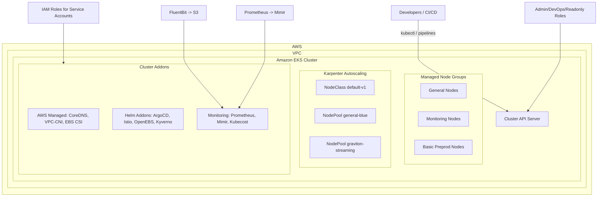

# Terragrunt EKS Cluster Create

This repository provisions and manages an **Amazon EKS cluster** using **Terragrunt** and a reusable Terraform module ([terraform-eks-cluster-create](https://github.com/sunilnerella23/terraform-eks-cluster-create)).  

It encapsulates:
- Cluster creation and lifecycle management
- Node groups (managed + Karpenter integration)
- Addon installation (AWS managed + community Helm charts)
- IAM Roles for Service Accounts (IRSA)
- Monitoring, logging, and metrics setup

---

## 📌 Prerequisites

- [Terraform](https://developer.hashicorp.com/terraform/downloads) (>= 1.5.0)
- [Terragrunt](https://terragrunt.gruntwork.io/docs/getting-started/install/) (>= 0.45.0)
- AWS CLI with valid credentials configured
- An existing VPC and subnets for EKS

---

## 📂 Repository Structure

├── terragrunt.hcl # Main Terragrunt configuration
├── configs/
│ └── irsa.yaml # IRSA roles definitions
├── helm_configs/
│ └── kyverno_values.yaml # Kyverno Helm chart configuration
└── account.hcl # AWS account-specific settings

---

## 📊 Architecture Overview

---

## ⚙️ Terragrunt Configuration Highlights

### Module Source
This repo sources the Terraform module:
git@github.com:sunilnerella23/terraform-eks-cluster-create.git//modules/eks-cluster-stack?ref=main

### Locals
- Reads AWS account ID from `account.hcl`
- Loads IRSA roles from `configs/irsa.yaml`
- Defines S3 buckets for **Grafana Mimir**

### Inputs
Key inputs defined for the cluster include:

- **Cluster settings**
  - Name, version (`1.32`)
  - Public/Private endpoint access
  - VPC and subnet mappings

- **Node groups**
  - Managed node groups (`general`, `preprodeksng_basic`, `monitoring_eks`)
  - Karpenter EC2 node classes & nodepools with taints, labels, resource limits

- **Addons**
  - AWS managed: `coredns`, `kube-proxy`, `vpc-cni`, `ebs-csi-driver`
  - Optional: ArgoCD, Istio, Cluster Autoscaler, Secrets Store CSI, Kube Prometheus Stack, OpenEBS, Mimir, Kyverno, Kafka Lag Exporter, etc.

- **IAM Roles**
  - Admin, ReadOnly, DevOps, Terraform execution roles
  - IRSA roles for specific services

- **Observability**
  - FluentBit with S3 output
  - Kube Prometheus Stack with remote write to Mimir
  - Prometheus Adapter for custom metrics
  - Grafana Mimir S3-backed long-term storage

---

## 🚀 Usage

### 1. Clone the repo
git clone git@github.com:sunilnerella23/terragrunt-eks-cluster-create.git
cd terragrunt-eks-cluster-create

2. Configure environment

Update:

account.hcl with your AWS account details

configs/irsa.yaml with application-specific IRSA roles

terragrunt.hcl with VPC, subnet IDs, and cluster-specific settings

3. Initialize Terragrunt
terragrunt init

4. Review the plan
terragrunt plan

5. Apply changes
terragrunt apply

🔧 Customization

Enable/disable addons by toggling flags in inputs (e.g., enable_argocd, enable_istio, enable_openebs)

Adjust node groups (instance types, scaling, taints/labels)

Add Helm releases under eks_addons_helm_releases

Extend IRSA roles in configs/irsa.yaml

🛠 Example: Adding a Node Group
eks_managed_node_groups = {
  analytics = {
    subnet_ids    = ["subnet-xxxxxx"]
    min_size      = 2
    max_size      = 5
    desired_size  = 3
    instance_types = ["m5.2xlarge"]
    capacity_type  = "ON_DEMAND"
    labels = {
      role = "analytics"
    }
  }
}

📊 Monitoring Stack

FluentBit → S3

Kube Prometheus Stack → Scraping cluster metrics

Grafana Mimir → Remote write backend

Prometheus Adapter → Custom Metrics API

Kubecost (optional) → Cost visibility

🔐 Security & Access

IAM roles (admin, readonly, devops, terraform) mapped into Kubernetes RBAC

IRSA used for fine-grained IAM permissions for addons like Mimir, FluentBit, Kyverno

Kyverno provides policy-based governance

🏗 Future Enhancements

Add CI/CD pipeline integration (Jenkins/GitHub Actions)

Expand addon library

Automate multi-environment deployments

